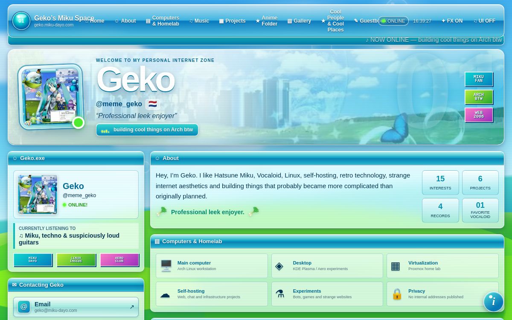

# MyHome

MyHome is a reusable, nostalgic personal-homepage system inspired by the
creative profile pages of the early web. It combines glossy Aero-style
presentation with a first-run setup wizard and a full visual editor.

The repository starts blank: no Geko profile, no Miku artwork, no social
accounts, and no example media are placed in a fresh installation.

## What it includes

- Static and server runtime modes
- Blank first-run setup wizard
- One-owner server administration
- Device-local setup studio for static sites
- Pages that can be shown, hidden, reordered, renamed and given custom icons
- Content blocks that can move between pages
- Completely custom sections
- Profile, social links, projects, records, anime, gallery, people and places
- Anime season and episode progress
- Local uploads or external URLs for every supported image field
- Local audio samples or external audio URLs for records
- Uploadable full-page backgrounds with fit, tile and position controls
- Animation toggles and intensity
- Importable theme presets
- One ZIP containing theme, layout, content and locally uploaded media
- A small required **MyHome by Geko** footer credit

## Editions

### Static

Use the setup studio in your browser, export a full ZIP, copy its
`myhome.json` and `assets/` into `public/`, and deploy the generated `dist/`
folder to GitHub Pages or another static host.

See [Static deployment](docs/STATIC-DEPLOYMENT.md).

### Server

The server edition uses the same frontend and adds a one-owner account,
persistent D1 content, and durable R2 uploads. The first included server adapter
targets Cloudflare Workers because it matches the proven storage model used by
the original live site.

See [Server deployment](docs/SERVER-DEPLOYMENT.md).

## Start locally

```sh
npm install
npm run dev
```

Open the shown address and complete the setup wizard. For static mode, studio
changes are stored in the current browser until you export them.

## Manual customization

- Content and layout: `public/myhome.json`
- Developer paths and runtime behavior: `src/config/developer.ts`
- Portable visual presets: `presets/`
- Configuration schema: [Configuration reference](docs/CONFIGURATION.md)
- Themes: [Themes and presets](docs/THEMES.md)
- Server security: [Security model](docs/SECURITY.md)

## Example design

The included Aero Glass preset is a neutral recreation of the visual direction
used by Geko's personal site. It uses only CSS-generated scenery and interface
effects. Personal text and copyrighted images are not included in the preset.



Documentation screenshots of the original personalized site may appear under
`docs/screenshots/` for reference only. Artwork visible inside those
screenshots is not part of the reusable template and remains owned by its
respective rights holders.

## Validation

```sh
npm run typecheck
npm test
npm run build
```

## License

MyHome uses the [MyHome No-Sale Share-Alike License 1.0](LICENSE). Companies may
use it for their own public websites and internal use. The license forbids
selling the original or modified template, selling MyHome themes or add-ons,
and charging clients for MyHome installation or customization. Shared modified
versions must keep the same license and required footer credit.

This is a source-available license, not an OSI-approved open-source license.
