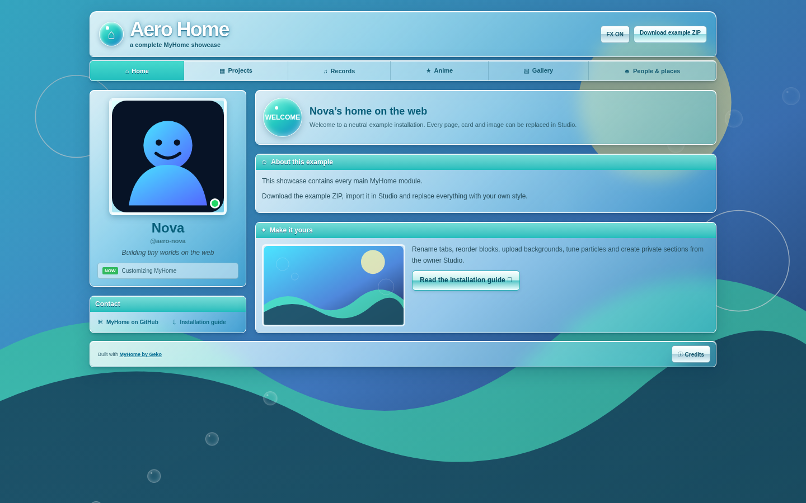
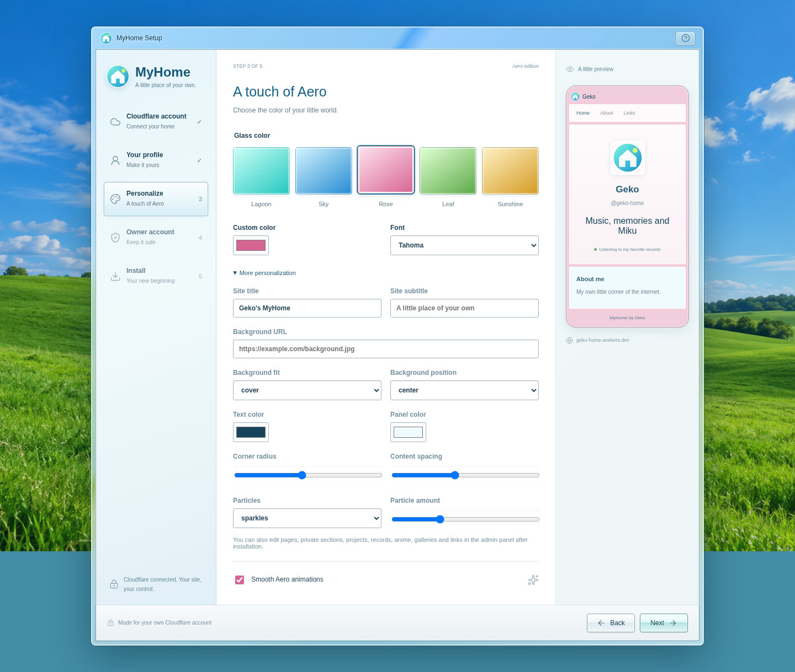

<a id="readme-top"></a>

<div align="center">


# MyHome

### Your own personal homepage, with a familiar touch of Aero

MyHome is a personal-site builder with a guided browser installer, a glassy
Aero-inspired interface, and an owner admin panel for profiles, themes and content.
Deploy into your own Cloudflare account and keep control of your site.

[](#project-status)
[](docs/deployment/WIZARD.md)
[](#install-myhome)
[](LICENSE)

[**View the showcase**](https://memegeko.github.io/MyHome/?demo=showcase) ·
[**Install MyHome**](#install-myhome) ·
[**Read the handbook**](docs/wiki/README.md) ·
[**Report a bug**](https://github.com/memegeko/MyHome/issues/new)

</div>

---

> [!NOTE]
> **The installer is in preview.** Local Linux installation and browser checks
> passed. PowerShell download, extraction and checksum checks passed on Linux;
> native Windows execution still needs testing. Live Cloudflare deployment and
> GitHub OAuth also need account testing.

## Meet MyHome

MyHome gives you a little place for your profile, projects, music, anime,
photos and favorite links. Fresh installations begin blank, ready for your
own identity and content. The showcase is an example of what you can build.

The guided installer downloads the project, prepares its dependencies and opens
an Aero-style browser wizard. Connect Cloudflare, personalize your site, create
an owner account and deploy to a `workers.dev` address.

<p align="center">
  
</p>

## What makes it different

| | |
| --- | --- |
| **A guided installer** | One command downloads MyHome and opens a browser wizard for account connection, profile, appearance and deployment. |
| **Aero throughout** | Glass borders, glossy controls, smooth transitions and a live profile preview. |
| **Your own hosting** | The Worker and D1 database belong to your Cloudflare account. R2 uploads are optional. |
| **Private drafts** | Save changes privately, preview them, then publish to your public site. |
| **Flexible content** | Profiles, links, projects, records, anime, galleries, people, places and custom sections. |
| **Detailed customization** | Global, page and section styling, fonts, colors, backgrounds, particles, spacing and privacy controls. |
| **Owner access** | Password login, optional GitHub owner login and single-use recovery codes. |
| **Portable content** | Export backups and share appearance presets without sharing your profile. |

## The setup experience

```text
Connect Cloudflare → Your profile → Personalize → Owner account
                  → Review → Install → Your site and admin links
```

Choose your name, username, bio, tagline and status, then tune colors and fonts.
More personalization includes backgrounds, panel colors, corners, spacing and
particles. Your choices initialize the deployed site and remain editable in
its admin panel.

<p align="center">
  
  
</p>

The [installation handbook](docs/wiki/Installation.md) walks through setup.
The [customization guide](docs/wiki/Customization.md) explains the controls, and
[publishing and recovery](docs/wiki/Publishing-and-recovery.md) covers owner access.

## Install MyHome

Paste one command into your terminal. Git and administrator access are not
required. If a compatible Node.js runtime is missing, the installer downloads
a local copy and verifies its SHA-256 checksum.

### Windows PowerShell

```powershell
& ([scriptblock]::Create((Invoke-WebRequest -UseBasicParsing 'https://raw.githubusercontent.com/memegeko/MyHome/work/scripts/install.ps1').Content))
```

### Linux / macOS

```bash
curl -fsSL https://raw.githubusercontent.com/memegeko/MyHome/work/scripts/install.sh | bash
```

These commands execute scripts from this repository's `work` branch. You can
inspect the [PowerShell script](scripts/install.ps1) or
[shell script](scripts/install.sh) before running them. Linux/macOS require
`curl`, `tar`, `gzip` and `sha256sum` or `shasum`.

1. Keep the terminal open while setup is running.
2. Connect your Cloudflare account and enter its account ID.
3. Choose your profile, site address and appearance.
4. Set up owner login and review the installation.
5. Install, open your site and save the recovery code privately.

The installer creates a new `MyHome` folder and preserves existing folders.
Reopen setup with `MyHome/start-setup.cmd` on Windows, or
`./MyHome/start-setup.sh` on Linux/macOS.

A `workers.dev` address is included. Cloudflare free-tier limits apply, and R2
may require billing activation. See the [deployment guide](docs/deployment/WIZARD.md)
for OAuth setup, custom domains and retry instructions.

## Installer support

| Area | Support |
| --- | --- |
| Systems | Windows PowerShell; Linux and macOS with Bash |
| Bundled runtime | Node.js 24.14.0; x64 and ARM64 |
| Existing runtime | Node.js 22.18 or newer, with npm |
| Downloads | Internet access required; no Git installation required |
| Hosting | Your own Cloudflare account, Worker and D1 database |
| Uploads | Optional R2 bucket; external image URLs work without R2 |
| Reinstallation | Existing folders are never overwritten |
| Verified locally | Linux installation with existing and bundled Node; desktop/mobile browser flows; PowerShell download and extraction checks |

## Documentation

The versioned [MyHome handbook](docs/wiki/README.md) is the starting point:

- [Installation](docs/wiki/Installation.md)
- [Customization](docs/wiki/Customization.md)
- [Publishing and recovery](docs/wiki/Publishing-and-recovery.md)
- [Browser deployment guide](docs/deployment/WIZARD.md)
- [Configuration reference](docs/customization/CONFIGURATION.md)
- [Themes and presets](docs/customization/THEMES.md)
- [Security model](docs/reference/SECURITY.md)
- [Screenshots and test notes](docs/screenshots/README.md)

## Development

For contributors working from a checkout:

```bash
npm ci
npm run dev
```

Prepare the local Worker environment and start server mode:

```bash
./scripts/bootstrap.sh server
npm run dev:server
```

Run the project checks:

```bash
npm run typecheck
npm test
npm run build:showcase
npm run build:static
npm run build:server
```

## Project status

MyHome is in preview. All 15 automated tests passed in the latest code validation,
along with typechecking, showcase generation and both production builds.
Desktop/mobile browser checks cover the public showcase and installer controls.
Documentation screenshots were captured during local Chromium tests on
7 October 2026; installer deployment responses were simulated.

Live Cloudflare deployment, real GitHub OAuth, and native Windows installer
execution remain unverified. The [screenshot notes](docs/screenshots/README.md)
distinguish simulated setup screens from actual public-site rendering.

## License

MyHome uses the [MyHome No-Sale Share-Alike License 1.0](LICENSE). Companies may
use it for their own public websites and internal use. Selling the template,
themes, add-ons, installation or customization services is forbidden. Shared
modifications must retain the same license and the small **MyHome by Geko**
footer credit.

This is a source-available license and is not OSI-approved open source.
Third-party artwork visible in documentation screenshots retains its own rights
and is not licensed as part of the template.

<p align="right">(<a href="#readme-top">back to top</a>)</p>
