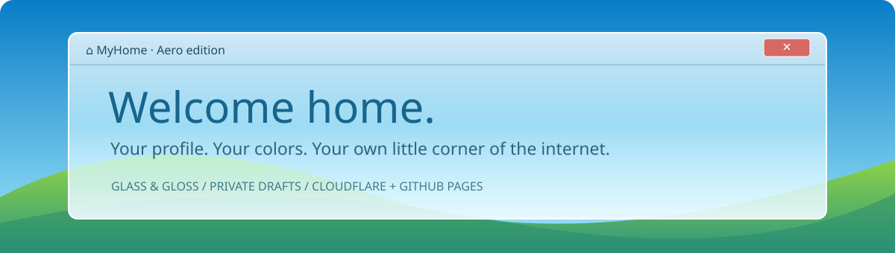
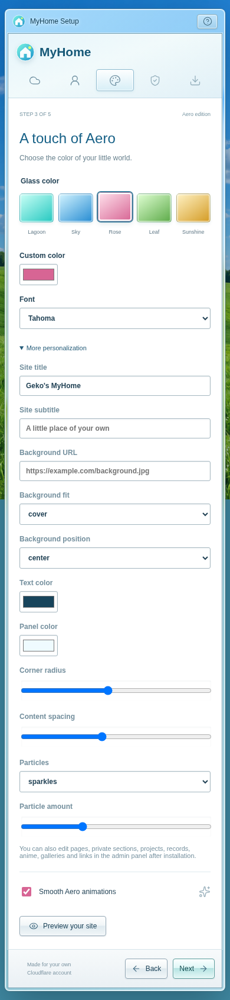

<div align="center">



# MyHome

### Your own nostalgic corner of the internet

A reusable personal-homepage builder with glossy Aero styling, encrypted owner
tools, flexible content blocks and both static and server deployments.

[](https://github.com/memegeko/MyHome/actions/workflows/ci.yml)
[](https://github.com/memegeko/MyHome/actions/workflows/deploy-pages.yml)
[](https://nodejs.org/)
[](LICENSE)

[Live setup](https://memegeko.github.io/MyHome/) ·
[Full showcase](https://memegeko.github.io/MyHome/?demo=showcase) ·
[Example ZIP](https://memegeko.github.io/MyHome/examples/myhome-showcase.zip) ·
[Illustrated wiki](docs/wiki/README.md) ·
[Installation](docs/getting-started/INSTALL.md) ·
[Static guide](docs/deployment/STATIC.md) ·
[Server guide](docs/deployment/SERVER.md)

</div>

---

## ✨ What is MyHome?

MyHome recreates the expressive, customizable feeling of early social-profile
pages without shipping anybody else's identity. Every fresh installation begins
blank and opens a first-time setup wizard.

- 🪟 Aero-inspired glass interface
- 🔐 One encrypted owner account in the static edition
- 🧰 Simple and Expert customization modes
- 🎨 Global, page and content-block styling
- ✨ Adjustable animations, particles and animated backgrounds
- 🧩 Optional projects, records, anime, gallery, people and places
- 🙈 Private pages, sections and contact details
- 🖼️ Local uploads or external media URLs
- 📦 Portable backups and shareable visual presets
- 🚀 GitHub Pages and Cloudflare Workers support

## 🚀 Fastest installation

### Cloudflare Workers browser wizard

For Windows and Linux, install Node.js 22.18+ and Git, clone this repository,
then run `npm ci` and `npm run setup:cloudflare`. A local browser wizard connects
your Cloudflare account, sets up your profile and owner login, and deploys your
site to a free `workers.dev` address. Save the recovery code at the end.

The admin panel supports private drafts, preview, and publishing. GitHub login
requires an OAuth app; R2 uploads are optional. See the
[browser deployment guide](docs/deployment/WIZARD.md).

Want to explore first? Open the
[complete live showcase](https://memegeko.github.io/MyHome/?demo=showcase) or
[download its importable ZIP](https://memegeko.github.io/MyHome/examples/myhome-showcase.zip).

### GitHub Pages — no terminal required

1. **Fork this repository.**
2. Open **Settings → Pages**.
3. Set the source to **GitHub Actions**.
4. Open your new Pages link and follow the setup wizard.

### Linux or macOS

```bash
git clone https://github.com/memegeko/MyHome.git
cd MyHome
./scripts/bootstrap.sh static
npm run dev
```

### Windows PowerShell

```powershell
git clone https://github.com/memegeko/MyHome.git
cd MyHome
.\scripts\bootstrap.ps1 static
npm run dev
```

The bootstrapper supports Arch Linux, Debian/Ubuntu, Fedora, openSUSE, Alpine,
macOS and Windows. See the complete
[installation guide](docs/getting-started/INSTALL.md).

## 🏠 Choose an edition

| Edition | Best for | Storage | Start command |
|---|---|---|---|
| **Static** | GitHub Pages and simple hosting | Encrypted repository configuration + browser | `npm run dev` |
| **Server** | Shared production site with durable uploads | Cloudflare D1 + optional R2 | `npm run dev:server` |

Prepare local server mode with:

```bash
./scripts/bootstrap.sh server
npm run dev:server
```

## 🗂️ Folder layout

```text
MyHome/
├── docs/
│   ├── customization/     # Configuration and theme references
│   ├── deployment/        # Static and server deployment guides
│   ├── getting-started/   # Installation instructions
│   ├── reference/         # Security documentation
│   └── screenshots/       # Documentation-only examples
├── presets/               # Shareable themes without personal content
├── public/                # Public configuration and static assets
├── scripts/               # Linux, macOS and Windows setup helpers
├── server/
│   ├── migrations/        # D1 database migrations
│   └── worker.ts          # Cloudflare Worker and API
├── src/
│   ├── components/        # Setup, Studio and public site UI
│   ├── config/            # Developer-controlled paths and modes
│   └── *.ts               # Runtime, encryption, media and backup logic
└── .github/workflows/     # Tests and GitHub Pages publishing
```

## 🎛️ Customize everything

Use **Customize → Advanced options** to change fonts, colors, borders, spacing,
motion, particles and backgrounds. Expert mode adds page and section overrides.
Tabs and content blocks can be hidden, reordered, renamed or made private.

Developers can also work directly with:

- [`public/myhome.json`](public/myhome.json) — public content and layout
- [`src/config/developer.ts`](src/config/developer.ts) — runtime paths
- [`presets/`](presets/) — portable visual presets
- [Configuration reference](docs/customization/CONFIGURATION.md)
- [Themes and presets](docs/customization/THEMES.md)
- [Security model](docs/reference/SECURITY.md)

## 🪟 A look through the glass

A Windows 7-inspired installer with glossy controls, gentle transitions and a
live profile preview. The site starts blank; the showcase is example content.


| Your public home | Setup on a small screen |
|---|---|
|  |  |

**Explore the illustrated wiki:** [Start here](docs/wiki/README.md) ·
[Install](docs/wiki/Installation.md) · [Customize](docs/wiki/Customization.md) ·
[Publish and recover](docs/wiki/Publishing-and-recovery.md)

These screenshots were captured during local Chromium browser checks on
**7 October 2026**. Installer deployment responses were simulated; live
Cloudflare deployment and GitHub OAuth still need account testing. See
[the screenshot notes](docs/screenshots/README.md) for details and image rights.

## ✅ Development checks

```bash
npm run typecheck
npm test
npm run build:static
npm run build:server
```

## 📜 License

MyHome uses the [MyHome No-Sale Share-Alike License 1.0](LICENSE). Companies may
use it for their own public websites and internal use. Selling the template,
themes, add-ons, installation or customization services is forbidden. Shared
modifications must retain the same license and the small **MyHome by Geko**
footer credit.

This is a source-available license and is not OSI-approved open source.

<div align="center">

Made with entirely too much glass, nostalgia and leek energy.

</div>
