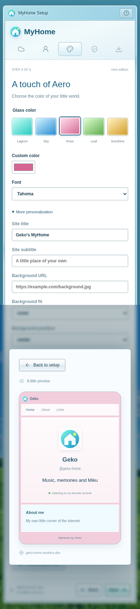

# 🎨 Make it yours

[Wiki home](README.md) · [Install](Installation.md) · [Publish](Publishing-and-recovery.md)

The installer starts with your display name, username, bio, tagline, status and
avatar URL. Color and font changes update its live preview.

Open **More personalization** for site title and subtitle, background URL,
background fit and position, text and panel colors, corner radius, content
spacing, and particle type and amount. These choices initialize the deployed
site. The installer preview illustrates profile, colors, font and corners;
backgrounds and particles render on the site itself.

After installation, open `/#/admin` and sign in. Studio offers profile and links,
pages and content blocks, projects, records, anime, galleries, people and places.
Simple and Expert modes offer global styling and page/section overrides.
Use privacy controls to keep selected content out of public responses.

Keep a backup before major edits. Theme presets let you share appearance
without sharing your profile content.

[Configuration reference](../customization/CONFIGURATION.md) ·
[Themes and presets](../customization/THEMES.md)
