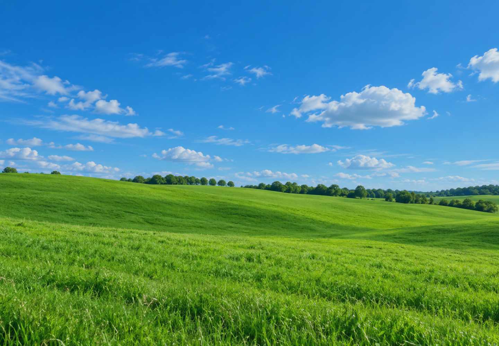
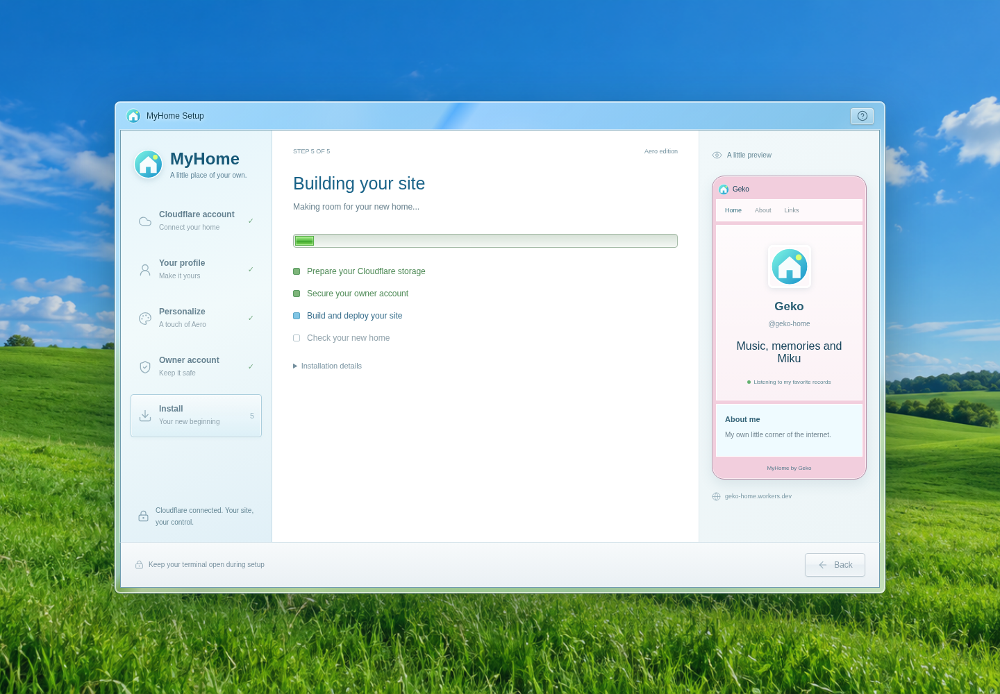
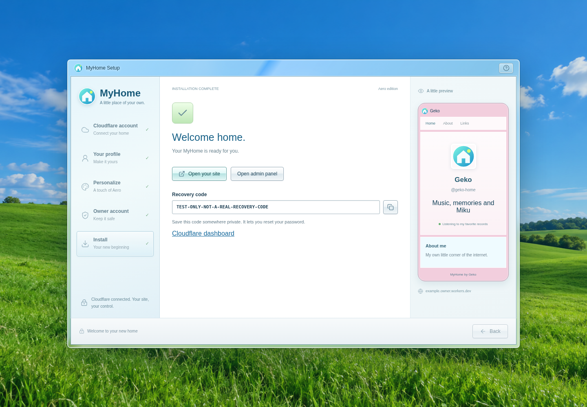

# ☁️ Install your own home

[Wiki home](README.md) · [Next: customization](Customization.md)

Install Git and Node.js 22.18 or newer. On Windows PowerShell or Linux:

```sh
git clone https://github.com/memegeko/MyHome.git
cd MyHome
npm ci
npm run setup:cloudflare
```

Keep the terminal open. Open the private setup link it prints if your browser
does not open automatically.



1. Connect your own Cloudflare account and enter its account ID.
2. Choose your display name, username, bio and site address prefix.
3. Pick your colors and font, then open **More personalization** for extra controls.
4. Choose password, GitHub, or both. GitHub requires your own OAuth app.
5. Review the choices and select **Install MyHome**.

The address is `site.account-subdomain.workers.dev`. You retain control of the
Worker and D1 database in your Cloudflare dashboard. R2 uploads are optional;
Cloudflare may require billing activation for R2. Free-tier usage limits apply.



Save the recovery code privately when installation finishes. The completion
screen gives you links to the site and admin panel.



These installer screenshots use simulated deployment responses. For OAuth app
configuration, retry behavior and custom domains, read the
[complete deployment guide](../deployment/WIZARD.md).

Prefer GitHub Pages? Follow the [static deployment guide](../deployment/STATIC.md).
