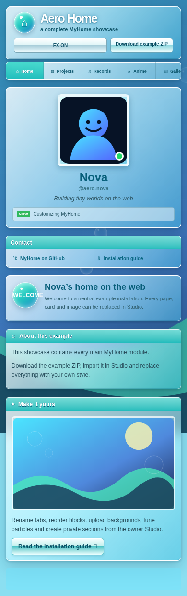

# 🔐 Drafts, publishing and recovery

[Wiki home](README.md) · [Customize](Customization.md)

In the Cloudflare server edition, **Save draft** keeps your edits private.
**Preview** shows the draft before **Publish** updates the public site.
Already-open public pages check for updates every 30 seconds while visible
and when the browser window regains focus.

Sign in with the owner password or the configured GitHub owner account.
The GitHub OAuth application must use your site's `/api/github/callback` URL.
Only the configured owner can access the editor.

If you lose the password, choose **Use recovery key**, enter your recovery code
and set a new password. Store the replacement code privately; recovery codes
are single-use and resetting invalidates old sessions.

Advanced owners can use Cloudflare's recovery override, described in the
[deployment guide](../deployment/WIZARD.md#recovery). Do not put passwords,
OAuth secrets or recovery codes in GitHub issues or screenshots.

Static mode uses an encrypted owner configuration and a separate publishing
workflow. See the [static guide](../deployment/STATIC.md) and
[security model](../reference/SECURITY.md).

## What was tested

Local tests cover private drafts, publishing, recovery-code rotation, session
invalidation, origin checks, login attempt limits and GitHub owner validation.
Browser checks capture desktop/mobile screenshots and verify installer controls.
Cloudflare deployment responses in installer browser tests are simulated;
these checks do not establish live Cloudflare deployment or real GitHub OAuth.
